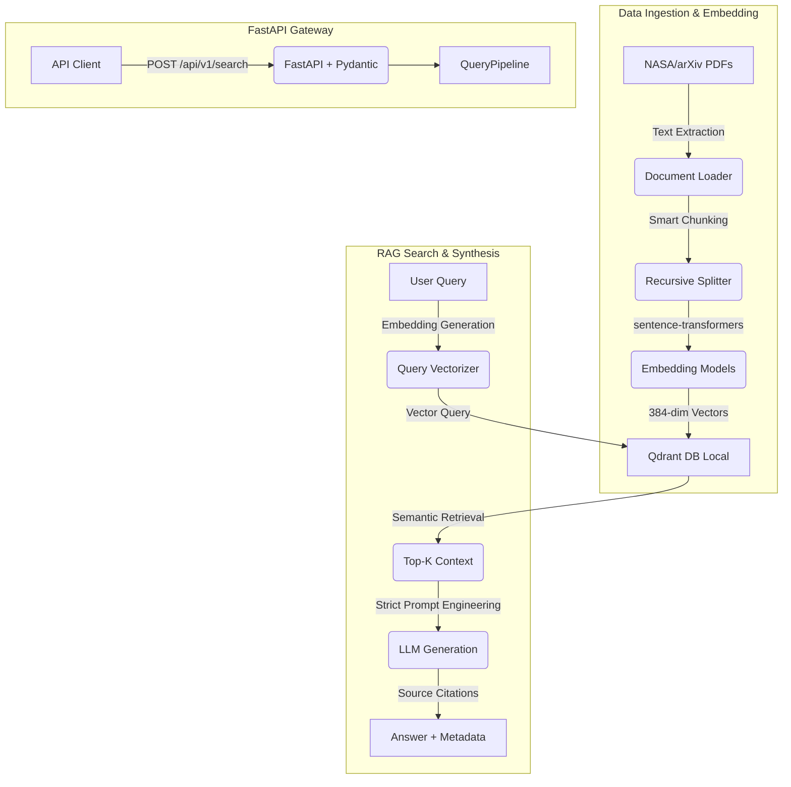

# 🌌 Antispace: Space Science RAG Assistant

[](https://www.python.org/)
[](https://qdrant.tech/)
[](https://fastapi.tiangolo.com/)
[](https://www.docker.com/)

**Antispace** is a production-grade, high-fidelity Retrieval-Augmented Generation (RAG) backend engine designed to ingest thousands of pages of academic space science papers, NASA reports, and astrophysics publications. It aims to answer queries with zero hallucination, millisecond latency, and precise source attribution.

---

## 🏗️ System Architecture



---

## 🛠️ Tech Stack

*   **Programming Language:** Python 3.11+
*   **Vector Database:** Qdrant (running locally in Docker)
*   **Embedding Model:** `all-MiniLM-L6-v2` (384-dimensional local embeddings) and `bge-small-en-v1.5`
*   **Orchestration:** LangChain / LlamaIndex
*   **API Framework:** FastAPI with Uvicorn and Pydantic
*   **Containerization:** Docker

---

## 📁 Project Structure

```text
Space-Paper/
├── README.md                           # Project documentation and architecture
├── embedding-test/                     # Initial sandbox and core RAG scripts
│   ├── save_to_qdrant.py               # Vector Store Wrapper (Upsert & Schema config)
│   ├── app.py                          # Initial embedding model similarity test
│   └── qdrant_storage/                 # Local Qdrant database persistent volume
└── .gitignore                          # Ignored files (venv, logs, etc.)
```

---

## 📅 10-Day Production Roadmap

- [x] **Day 1:** Spin up local Qdrant Vector DB via Docker and verify Dashboard.
- [x] **Day 2:** Connect python client, manage collection lifecycle, generate embeddings, and upsert vectors with rich metadata and latency logging.
- [x] **Day 3:** Implement semantic retrieval with `client.search()` and similarity score filtering.
- [x] **Day 4:** Set up document pipelines to scrape real PDF documents from NASA/arXiv archives.
- [x] **Day 5:** Develop recursive chunking strategies with LangChain text splitters.
- [x] **Day 6:** Implement bulk upsert operations to ingest large volumes of vectors efficiently.
- [x] **Day 7:** Initialize FastAPI backend gateway and design strict Pydantic payload schemas.
- [x] **Day 8:** Build `/api/v1/search` endpoints for semantic query routing.
- [ ] **Day 9:** Integrate LLM APIs with strict grounding prompts to eliminate hallucinations.
- [ ] **Day 10:** Connect all components into a full end-to-end RAG pipeline, measure latency, and document deployment.

---

## ⚙️ Quick Start

### 1. Prerequisites
Ensure you have Docker Desktop and Python 3.11+ installed.

### 2. Set Up Qdrant
Spin up the local vector database instance using Docker:
```bash
docker run -d -p 6333:6333 -p 6334:6334 \
  -v $(pwd)/embedding-test/qdrant_storage:/qdrant/storage:z \
  --name qdrant \
  qdrant/qdrant
```
You can access the UI dashboard at [http://localhost:6333/dashboard](http://localhost:6333/dashboard).

### 3. Installation
Navigate to the directory and install dependencies:
```bash
cd embedding-test
pip install qdrant-client sentence-transformers torch
```

### 4. Run Initial Vector Upsert
To run the Day 2 implementation (collection creation, local embedding generation using GPU/MPS on Mac, and upsert):
```bash
python save_to_qdrant.py
```

---

## 📈 Engineering Guidelines Implemented
*   **Performance Metrics First:** Every pipeline segment measures and logs transaction latency.
*   **Object-Oriented Design:** Vector database logic is encapsulated into a reusable `SpaceScienceVectorStore` wrapper class.
*   **Idempotency & Safety:** Collection initialization checks for existence rather than overwriting data destructively.
*   **Structured Metadata:** Vektors are stored with rich payloads containing full text, source identifiers, and text counts for downstream filtering.
