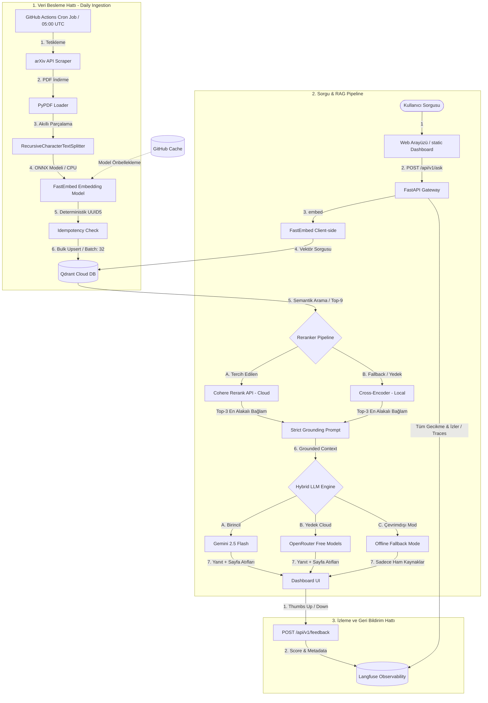

# 🌌 Antispace: Space Science RAG Assistant

**Antispace**, akademik uzay bilimleri makalelerini (arXiv, NASA, JWST performans raporları vb.) tarayan, parçalayan (chunking), vektörleştiren ve bunlara dayanarak **sıfır halüsinasyon (zero-hallucination)** ve **sayfa bazlı atıflarla (page-level citations)** yanıtlar üreten, end-to-end (uçtan uca) üretim seviyesinde (production-grade) bir **RAG (Retrieval-Augmented Generation)** asistanıdır.

Bu proje, bir staj sunumunda veya teknik mülakatta mimari kararları ve yazılım mühendisliği prensiplerini en iyi şekilde açıklayabilmeniz amacıyla tasarlanmıştır.

---

## 🏗️ Sistem Mimarisi & Akış Diyagramı (System Architecture)

Sistem; **Veri Besleme (Ingestion)**, **Sorgulama & Sentez (RAG Query)** ve **Gözlemlenebilirlik (Observability)** olmak üzere 3 ana boru hattından (pipeline) oluşur.


```mermaid
flowchart TD
    subgraph Ingestion_Pipeline [1. Veri Besleme Hattı - Daily Ingestion]
        direction TB
        Cron[GitHub Actions Cron Job / 05:00 UTC] -->|1. Tetikleme| Scrap[arXiv API Scraper]
        Scrap -->|2. PDF İndirme| PDF[PyPDF Loader]
        PDF -->|3. Akıllı Parçalama| Split[RecursiveCharacterTextSplitter]
        Split -->|4. ONNX Modeli / CPU| FE[FastEmbed Embedding Model]
        FE -->|5. Deterministik UUID5| UUID[Idempotency Check]
        UUID -->|6. Bulk Upsert / Batch: 32| QC[(Qdrant Cloud DB)]
    end

    subgraph Query_Pipeline [2. Sorgu & RAG Pipeline]
        direction TB
        User([Kullanıcı Sorgusu]) -->|1| Web[Web Arayüzü / static Dashboard]
        Web -->|2. POST /api/v1/ask| API[FastAPI Gateway]
        API -->|3. embed| FE_Q[FastEmbed Client-side]
        FE_Q -->|4. Vektör Sorgusu| QC
        QC -->|5. Semantik Arama / Top-9| Rerank{Reranker Pipeline}
        
        Rerank -->|A. Tercih Edilen| Cohere[Cohere Rerank API - Cloud]
        Rerank -->|B. Fallback / Yedek| CE[Cross-Encoder - Local]
        
        Cohere -->|Top-3 En Alakalı Bağlam| Prompt[Strict Grounding Prompt]
        CE -->|Top-3 En Alakalı Bağlam| Prompt
        
        Prompt -->|6. Grounded Context| LLM{Hybrid LLM Engine}
        LLM -->|A. Birincil| Gemini[Gemini 2.5 Flash]
        LLM -->|B. Yedek Cloud| OR[OpenRouter Free Models]
        LLM -->|C. Çevrimdışı Mod| Offline[Offline Fallback Mode]
        
        Gemini -->|7. Yanıt + Sayfa Atıfları| Res[Dashboard UI]
        OR -->|7. Yanıt + Sayfa Atıfları| Res
        Offline -->|7. Sadece Ham Kaynaklar| Res
    end

    subgraph Observability_Pipeline [3. İzleme ve Geri Bildirim Hattı]
        direction TB
        Res -->|1. Thumbs Up / Down| Feed[POST /api/v1/feedback]
        Feed -->|2. Score & Metadata| LF[(Langfuse Observability)]
        API -->|Tüm Gecikme & İzler / Traces| LF
    end
    
    %% Cache mekanizması
    Cache[(GitHub Cache)] -.->|Model Önbellekleme| FE
```

---

## 🛠️ Teknoloji Yığını (Tech Stack) & Mühendislik Kararları

Projede verilen her mimari kararın arkasında güçlü bir **mühendislik gerekçesi (trade-off)** yatmaktadır. Staj sunumlarında bu kararları şu şekilde savunabilirsiniz:

### 1. Neden SentenceTransformers yerine FastEmbed?
*   **Sorun:** `sentence-transformers` paketi PyTorch (torch) bağımlılığı gerektirir. Bu da Docker imaj boyutunun **2.5 GB üzerine çıkmasına**, GitHub Actions üzerinde disk/bellek limitlerinin aşılmasına ve CPU üzerinde yavaş çalışmasına yol açıyordu.
*   **Çözüm:** **FastEmbed (by Qdrant)** kütüphanesine geçildi. FastEmbed, ONNX Runtime kullanarak modelleri CPU üzerinde son derece hafif ve optimize bir şekilde çalıştırır. İmaj boyutumuz **~600 MB seviyelerine düştü**, PyTorch bağımlılığı kalktı ve işlemci yükü azaldı.

### 2. Neden Qdrant Cloud?
*   Uygulamanın stateless (durumsuz) çalışabilmesi ve Render/Railway gibi platformlara sorunsuzca deploy edilebilmesi için vektör veritabanı buluta (Qdrant Cloud) taşındı. Böylece disk bağımlılığı ortadan kalktı.

### 3. Neden Reranking (Yeniden Sıralama) Kullanıyoruz?
*   Vektör aramaları sadece kozinüs benzerliğine bakar ve bazen anahtar kelime uyumunu gözden kaçırabilir.
*   Sistemde **Cohere Rerank API** kullanılarak Qdrant'tan dönen 9 aday belge yeniden sıralanır ve en kaliteli 3 belge LLM'e beslenir. Cohere API'de kota aşımı veya hata olursa sistem otomatik olarak yerel **Cross-Encoder** (`ms-marco-MiniLM-L-6-v2`) modeline düşer (local fallback).

---

## 🚀 Stajda Anlatabileceğiniz Kritik Tasarım Kalıpları (Design Patterns)

Mülakatlarda en çok puan toplayan ve projenin "öğrenci işi" olmadığını gösteren 4 ana mühendislik pratikleri:

### 1. Deterministik UUID5 ile Idempotency (Yinelenen Veri Engelleme)
*   **Problem:** Her gün cron job ile arXiv makaleleri indirildiğinde, aynı metin parçaları (chunk) tekrar tekrar veritabanına yazılırsa veritabanı şişer ve mükerrer kayıtlar oluşur.
*   **Çözüm:** Rastgele UUID üretmek yerine, metin içeriğini `uuid.uuid5(uuid.NAMESPACE_DNS, chunk_text)` fonksiyonuna sokarak **deterministik (metne bağlı benzersiz) UUID'ler** ürettik.
*   **Sonuç:** Aynı metin veritabanına bin kere de gönderilse, Qdrant üzerindeki ID'si aynı kalacağı için üzerine yazar (upsert) ve veri tekrarını sıfıra indirir.

### 2. Hybrid LLM Fallback & Offline Mode (Dayanıklılık)
*   Bulut servislerinin kesintiye uğraması RAG sistemini çökertmemelidir. Bunun için **üç aşamalı yedeklilik mekanizması** kuruldu:
    1.  Öncelikle yüksek hızlı ve geniş bağlam pencereli **Gemini 2.5 Flash** çağrılır.
    2.  Gemini API kotası dolarsa veya hata verirse, sistem otomatik olarak **OpenRouter** üzerinden yedek modellere (`Gemma-2`, `Qwen-2`) yönlenir.
    3.  Tüm internet veya API servisleri kesilirse, sistem **Offline Mode**'a geçer. LLM yanıtı yerine doğrudan Qdrant'tan gelen en alakalı makale paragraflarını ve sayfa numaralarını kullanıcıya gösterir.

### 3. Langfuse ile LLM Observability (Gözlemlenebilirlik)
*   FastAPI üzerinden yapılan tüm sorguların gecikme süreleri (latency), token tüketimleri, LLM girdi/çıktıları ve kullanıcıların arayüzden verdiği beğeni (Thumbs Up/Down) geri bildirimleri **Langfuse** API'sine asenkron olarak gönderilir. Bu sayede hangi sorguların kalitesiz yanıt ürettiği canlı olarak izlenebilir.

### 4. GitHub Actions CI/CD ve Model Önbellekleme
*   Günde bir kez arXiv'den veri çekip vektörleştiren `.github/workflows/daily_ingest.yml` pipeline'ı oluşturuldu.
*   İş akışının hızlı tamamlanması için `actions/cache@v4` kullanılarak FastEmbed ONNX modeli GitHub sunucularında önbelleğe alındı. Model her gün internetten sıfırdan indirilmez, pipeline süresi **%80 kısalarak ~40 saniyeye düşer**.

---

## 💻 API Uçları (API Endpoints)

FastAPI mimarisi Pydantic veri doğrulamasıyla korunmaktadır:

*   `GET /api/v1/health`: Veritabanı bağlantısı, koleksiyon varlığı, toplam vektör sayısı ve API anahtarı durumlarını dönen tanı ucu.
*   `POST /api/v1/search`: Ham semantik arama gerçekleştirir, benzerlik skorlarını döner.
*   `POST /api/v1/ask`: RAG akışını çalıştırır. Gelen soruyu vektörleştirir, arama yapar, rerank eder, prompt'u hazırlar ve LLM cevabını sayfa atıflarıyla döner.
*   `POST /api/v1/feedback`: Kullanıcı memnuniyet skorlarını toplar ve Langfuse'a kaydeder.
*   `POST /api/v1/ingest/daily`: Arayüzden manuel olarak arXiv ingestion sürecini tetikler.

---

## ⚙️ Hızlı Başlangıç & Yerel Çalıştırma (Quick Start)

### 1. Gerekli Ortam Değişkenleri
Projenin kök dizininde bir `.env` dosyası oluşturup bilgileri girin:
```env
QDRANT_URL=https://your-qdrant-cluster.io
QDRANT_API_KEY=your_qdrant_api_key
GEMINI_API_KEY=your_gemini_api_key
COHERE_API_KEY=your_cohere_key (opsiyonel)
LANGFUSE_PUBLIC_KEY=your_public_key (opsiyonel)
LANGFUSE_SECRET_KEY=your_secret_key (opsiyonel)
```

### 2. Docker ile Çalıştırma
```bash
# Docker imajını derleyin ve yerelde başlatın
docker compose up --build
```
Uygulama ayağa kalktığında tarayıcınızdan **`http://localhost:8000`** adresine giderek arayüze erişebilirsiniz.

### 3. Manuel Veri Besleme (Data Ingestion)
Yereldeki PDF dosyalarını veya yeni arXiv makalelerini Qdrant Cloud'a yüklemek için:
```bash
# JWST ve Kepler PDF'lerini yükler
python embedding-test/ingest_to_qdrant.py

# Günlük arXiv astrofizik makalelerini çekip yükler
python embedding-test/ingest_daily_arxiv.py
```
