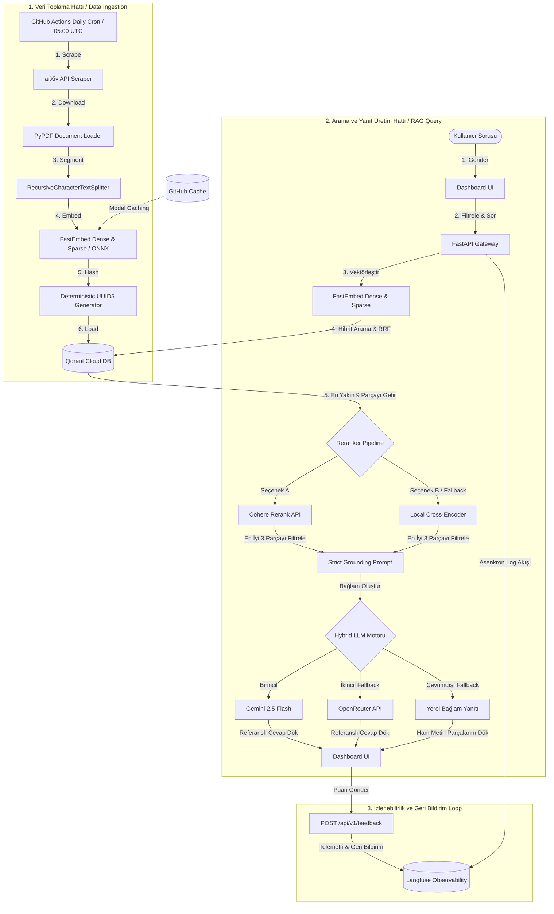

# 🌌 Antispace: Uzay Bilimleri RAG Asistanı

**Canlı Site Linki:** https://space-paper.onrender.com

**Antispace**, uzay bilimleri ve astrofizik literatürü için tasarlanmış yüksek performanslı, üretim kalitesinde (production-grade) bir Retrieval-Augmented Generation (RAG) asistanıdır. Akademik yayınları (arXiv makaleleri, NASA raporları ve JWST dokümantasyonları) günlük olarak otomatik çeker ve kullanıcılara halüsinasyonsuz, sayfa düzeyinde kaynak gösteren doğrulanmış yanıtlar sunar.

---

## 🎯 1. Problemi Tanıma ve Çözüm (Problem & Solution)

### Problem
Uzay bilimleri ve astrofizik literatürü son derece geniş, teknik ve sürekli güncellenen bir yapıya sahiptir. Standart Büyük Dil Modelleri (LLM'ler) bu alanda araştırma yaparken şu kritik sorunlarla karşılaşır:
1. **Bilgi Kesintisi (Knowledge Cutoff):** LLM'ler en son yayınlanan (örneğin dün çıkan bir arXiv makalesi) bilimsel gelişmelerden habersizdir.
2. **Halüsinasyon (Uydurma Bilgi):** Teknik detaylar, karmaşık formüller ve sayısal veriler hakkında LLM'ler yanlış veya uydurma bilgiler üretebilir.
3. **Doğrulanabilirlik Eksikliği:** LLM yanıtlarının hangi kaynağa, hangi makaleye veya makalenin hangi sayfasına dayandığı bilinemez.

### Çözüm (Antispace)
Antispace, bu problemleri çözmek için **RAG (Retrieval-Augmented Generation)** mimarisini kullanır:
* **Güncel Veri:** Her sabah yeni makaleleri otomatik olarak veritabanına ekler.
* **Sıfır Halüsinasyon Garantisi:** LLM'e sadece sistemin veritabanından bulup getirdiği makale parçalarını (bağlam) okuma ve bu bağlamın dışına çıkmama talimatı verilir.
* **Sayfa Düzeyinde Referans:** Her cevap, bilginin alındığı makale adı ve tam sayfa numarası ile birlikte sunulur.

---

## 🏗️ 2. Mimari Kurma ve Anlatma (Architecture Setup & Pipeline)

Sistem mimarisi üç temel iş akışı üzerine kurulmuştur: **Veri Toplama (Ingestion)**, **Arama ve Yanıt Üretimi (RAG Query & Synthesis)** ve **İzlenebilirlik (Observability)**.


```mermaid
flowchart TD
    subgraph Ingestion_Pipeline [1. Veri Toplama Hattı / Data Ingestion]
        direction TB
        Cron[GitHub Actions Daily Cron / 05:00 UTC] -->|1. Scrape| Scrap[arXiv API Scraper]
        Scrap -->|2. Download| PDF[PyPDF Document Loader]
        PDF -->|3. Segment| Split[RecursiveCharacterTextSplitter]
        Split -->|4. Embed| FE[FastEmbed Dense & Sparse / ONNX]
        FE -->|5. Hash| UUID[Deterministic UUID5 Generator]
        UUID -->|6. Load| QC[(Qdrant Cloud DB)]
    end

    subgraph Query_Pipeline [2. Arama ve Yanıt Üretim Hattı / RAG Query]
        direction TB
        User([Kullanıcı Sorusu]) -->|1. Gönder| Web[Dashboard UI]
        Web -->|2. Filtrele & Sor| API[FastAPI Gateway]
        API -->|3. Vektörleştir| FE_Q[FastEmbed Dense & Sparse]
        FE_Q -->|4. Hibrit Arama & RRF| QC
        QC -->|5. En Yakın 9 Parçayı Getir| Rerank{Reranker Pipeline}
        
        Rerank -->|Seçenek A| Cohere[Cohere Rerank API]
        Rerank -->|Seçenek B / Fallback| CE[Local Cross-Encoder]
        
        Cohere -->|En İyi 3 Parçayı Filtrele| Prompt[Strict Grounding Prompt]
        CE -->|En İyi 3 Parçayı Filtrele| Prompt
        
        Prompt -->|Bağlam Oluştur| LLM{Hybrid LLM Motoru}
        LLM -->|Birincil| Gemini[Gemini 2.5 Flash]
        LLM -->|İkincil Fallback| OR[OpenRouter API]
        LLM -->|Çevrimdışı Fallback| Offline[Yerel Bağlam Yanıtı]
        
        Gemini -->|Referanslı Cevap Dök| Res[Dashboard UI]
        OR -->|Referanslı Cevap Dök| Res
        Offline -->|Ham Metin Parçalarını Dök| Res
    end

    subgraph Observability_Pipeline [3. İzlenebilirlik ve Geri Bildirim Loop]
        direction TB
        Res -->|Puan Gönder| Feed[POST /api/v1/feedback]
        Feed -->|Telemetri & Geri Bildirim| LF[(Langfuse Observability)]
        API -->|Asenkron Log Akışı| LF
    end
    
    %% Caching
    Cache[(GitHub Cache)] -.->|Model Caching| FE
```

### Teknik İş Akışı Detayları:
1. **Otomatik İndeksleme:** Günlük tetiklenen GitHub Actions akışı ile arXiv üzerindeki kozmoloji ve astrofizik makaleleri taranır, `PyPDF` ile okunur, `RecursiveCharacterTextSplitter` ile 800 karakterlik parçalara bölünür. ONNX formatındaki **FastEmbed** kütüphanesi kullanılarak hem **Dense** (`all-MiniLM-L6-v2`) hem de **Sparse** (`Qdrant/bm25`) vektörleri üretilir ve **Qdrant Cloud**'a yüklenir.
2. **Idempotency (UUID5):** Çift kayıtları önlemek için her metin parçasının deterministik UUID5 karması (hash) oluşturulur.
3. **Hibrit Arama (Dense + Sparse) ve RRF:** Kullanıcı sorgusu hem dense hem de sparse (BM25) olarak vektörleştirilir. Qdrant'ın `query_points` API'si ve **RRF (Reciprocal Rank Fusion)** algoritması kullanılarak iki arama sonucundan en alakalı adaylar birleştirilir.
4. **Ön-Filtreleme (Pre-filtering):** Kullanıcı arayüzden belirli bir kaynak makale seçtiğinde, Qdrant üzerinde `source` alanı için tanımlı `keyword` indeksi kullanılarak ön-filtreleme uygulanır ve arama alanı daraltılır.
5. **Akıllı Sıralama (Reranking):** Qdrant'tan gelen ilk 9 aday, **Cohere Rerank** (veya hata durumunda yerel **Cross-Encoder**) ile tekrar sıralanarak en alakalı 3 parçaya düşürülür.
6. **Çoklu LLM Desteği:** Birincil model olarak **Gemini 2.5 Flash** kullanılır. API limitleri veya kesintilerde **OpenRouter** üzerinden yedek modellere, internet yoksa doğrudan ham arama sonuçlarına (Offline Mode) düşüş (fallback) sağlanır.

---

## 📈 3. Çıktılar Nedir ve Nasıl Monitörlüyorsun Sistemi? (Outputs & Monitoring)

### Sistem Çıktıları (Outputs)
* **Kullanıcı Yanıtı:** Kullanıcıya sunulan, doğrudan veritabanındaki makalelere dayanan, halüsinasyon içermeyen teknik cevaplar.
* **Kaynak ve Sayfa Numaraları:** Cevapta yer alan iddiaların hangi belgeden ve hangi sayfadan alındığını gösteren referanslar (Örn: `[Kepler-Mission.pdf, Page 12]`).
* **Çalışma Zamanı RAGAs Metrikleri (Dinamik):** Her RAG yanıtı için Gemini API yardımıyla çalışma zamanında hesaplanan **Faithfulness** (Güvenilirlik) ve **Answer Relevance** (Cevap Uygunluğu) skorları (0.0 - 1.0 arası). Bu skorlar statik veya hard-coded değildir, LLM-as-a-judge prensibiyle anlık üretilir.

### Sistem Monitörleme (Observability & Monitoring)
Sistemin performansı ve kalitesi iki temel sütun üzerinden izlenir:
1. **Langfuse ile Uçtan Uca İzleme (Tracing):**
   * Kullanıcının sorduğu sorudan başlayarak vektör arama süresi, rerank süresi, LLM çağrı süresi ve harcanan token miktarı gibi tüm metrikler asenkron olarak **Langfuse** paneline aktarılır.
   * Hangi aşamada gecikme yaşandığı (bottleneck) veya hangi API'nin hata verdiği görsel olarak izlenebilir.
2. **Kullanıcı Geri Bildirim Döngüsü (Feedback Loop):**
   * Arayüzdeki beğenme/beğenmeme (thumbs up/down) butonları aracılığıyla toplanan kullanıcı geri bildirimleri, doğrudan ilgili sorgunun Langfuse üzerindeki izleme kaydına (trace) bağlanır. Bu sayede kalitesiz cevap üreten sorgular kolayca tespit edilip optimize edilebilir.
3. **Çalışma Zamanı Değerlendirmesi (Runtime Evaluation - RAGAs):**
   * **Dinamik Değerlendirme:** Sunucuda geçerli bir `GEMINI_API_KEY` tanımlıysa, Gemini 2.5 Flash modeli JSON modunda çalıştırılarak LLM-as-a-judge yöntemiyle üretilen her yanıt için anlık güvenilirlik ve alaka testleri yapılır.
   * **Koşullu Çalışma:** Eğer API anahtarı tanımlı değilse, arama ve cevaplama fonksiyonu kesintiye uğramadan çalışmaya devam eder; sadece değerlendirme skorları `N/A` (Null) döner ve UI üzerinde "RAGAs: Pasif (API Key Eksik)" uyarısı gösterilir.
   * **Langfuse Entegrasyonu:** Üretilen dinamik skorlar, Langfuse aktifse asenkron olarak Langfuse sistemine gönderilerek panelde görselleştirilir.

---

## 🚀 4. Daha İyi Nasıl Yapılabilir, Gelecekte Geliştirilebilecek Yerler (Future Roadmap)

### 🛠️ Gelecek Yol Haritası (Future Roadmap)
1. **Multimodal (Çoklu Modlu) RAG Yapısı:**
   * **Mevcut Durum:** Makalelerdeki grafikler, tablolar ve görsel veriler şu an sadece metin parçaları olarak okunmaktadır.
   * **Geliştirme:** PDF sayfaları görsel olarak da analiz edilip Gemini'nin görsel anlama yeteneğiyle multimodal RAG kurgusu kurulabilir. Tablolar ve grafikler vektör veritabanına görsel-vektör olarak eklenebilir.
2. **Ajan Tabanlı Kendi Kendini Düzeltme (Agentic Self-Correction Loop):**
   * **Mevcut Durum:** Yanıt üretilir ve sadakat skoru düşük çıksa bile kullanıcıya gösterilir.
   * **Geliştirme:** Eğer üretilen yanıtın *Faithfulness* skoru belirli bir eşiğin altındaysa, sistem yanıtı kullanıcıya vermeden önce aramayı genişletip (Query Expansion) veya farklı parçaları çekip cevabı otomatik olarak düzeltecek bir ajan akışına dönüştürülebilir.
3. **Semantik Parçalama (Semantic Chunking):**
   * **Mevcut Durum:** Metinler sabit karakter sayılarına göre bölünmektedir.
   * **Geliştirme:** Metnin anlamsal akışına göre (paragraf geçişleri, konu değişimleri) akıllı semantik parçalama yapılarak bağlam bütünlüğü en üst seviyeye çıkarılabilir.

### 🌟 Son Yapılan Geliştirmeler (Recent Features)
* **Hibrit Arama (Dense + Sparse Search):** Qdrant'ın Sparse Vector desteği ve BM25 entegrasyonu (`Qdrant/bm25`) başarıyla sisteme entegre edildi. Dense arama (`all-MiniLM-L6-v2`) ve Sparse arama sonuçları RRF (Reciprocal Rank Fusion) ile birleştirilerek hibrit arama aktif hale getirildi.
* **Kaynak Ön-Filtreleme (Pre-filtering):** Kullanıcıların aramayı ve RAG cevaplarını belirli bir kaynak doküman (PDF) ile sınırlandırabilmesi sağlandı. `source` alanı için Qdrant üzerinde keyword indeksi oluşturuldu.
* **Dinamik RAGAs Değerlendirmesi:** Gemini 2.5 Flash kullanılarak her RAG sorgusu için gerçek zamanlı Faithfulness ve Answer Relevance skorlaması ve bu skorların Langfuse'a aktarımı sağlandı.
* **Gelişmiş Arayüz Göstergeleri:** Kullanıcı paneline RAGAs değerlendirme durumu (Aktif / API Key Eksik) ve Ön-filtreleme durum rozetleri eklendi.
* **Hafıza ve Performans Optimizasyonları:** FastEmbed modellerinin `threads=1` ile çalıştırılması, Docker konteynerında izin yönetimi ve Render üzerinde aşırı bellek tüketiminin (out-of-memory) önüne geçilmesi için ONNX reranker optimizasyonları tamamlandı.

---

## ⚙️ 5. Teknik Detaylar ve Hızlı Başlangıç (Technical Details & Quick Start)

### API Referansı
* `GET /api/v1/health` - Sağlık durumu ve veritabanı bağlantı kontrolü.
* `POST /api/v1/search` - Ham semantik arama (kaynak filtreleme destekli).
* `POST /api/v1/ask` - Uçtan uca RAG sorgusu (kaynak filtreleme, kaynak atıfları ve çalışma zamanı Ragas değerlendirme skorlarını döner).
* `POST /api/v1/feedback` - Kullanıcı geri bildirim kaydı.
* `POST /api/v1/ingest/daily` - Yeni arXiv makalelerini çekmek için manuel tetikleyici.

### Çevre Değişkenleri
Projenin kök dizininde bir `.env` dosyası oluşturun:
```env
QDRANT_URL=https://your-qdrant-cluster.io
QDRANT_API_KEY=your_qdrant_api_key
GEMINI_API_KEY=your_gemini_api_key
COHERE_API_KEY=your_cohere_key (isteğe bağlı)
LANGFUSE_PUBLIC_KEY=your_public_key (isteğe bağlı)
LANGFUSE_SECRET_KEY=your_secret_key (isteğe bağlı)
```

### Docker ile Çalıştırma
```bash
docker compose up --build
```
Uygulama arayüzüne `http://localhost:8000` adresinden erişebilirsiniz.

### Manuel Veri Yükleme ve Değerlendirme
```bash
# Yerel PDF'leri yüklemek için
python embedding-test/ingest_to_qdrant.py

# arXiv'den güncel makaleleri çekmek için
python embedding-test/ingest_daily_arxiv.py

# RAG performans değerlendirme testini çalıştırmak için
python embedding-test/evaluate_rag.py
```
