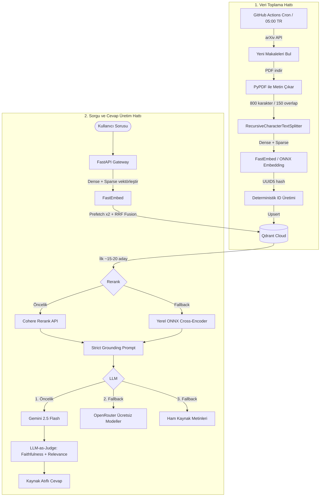

# 🌌 Antispace: Uzay Bilimleri RAG Asistanı

**Canlı Site:** https://space-paper.onrender.com

Bu doküman, projeyi bir mülakatta anlatıyormuş gibi baştan sona, adım adım açıklamak için yazıldı. Amaç sadece "ne yaptım" değil, "neden böyle yaptım" ve "nerede zorlandım, nasıl çözdüm" sorularına da hazırlıklı olmak.

---

## 🎤 Tek Cümlelik Özet (Elevator Pitch)

> "Antispace, arXiv makaleleri, NASA raporları ve JWST dokümantasyonu üzerinde çalışan; cevaplarını **sadece** veritabanındaki kaynaklara dayandıran, her iddiayı sayfa numarasıyla kaynak gösteren, halüsinasyon riskini mimari seviyede minimize eden production-grade bir RAG (Retrieval-Augmented Generation) sistemi."

---

## 1️⃣ Problem Neydi?

Uzay bilimleri / astrofizik literatüründe bir LLM'e doğrudan soru sormanın üç somut riski var:

1. **Bilgi kesintisi:** Model, dün yayınlanan bir arXiv makalesinden habersiz.
2. **Halüsinasyon:** Sayısal veriler, formüller, misyon detayları gibi teknik konularda model kendinden emin ama yanlış cevaplar üretebiliyor.
3. **Doğrulanamazlık:** Cevabın hangi makaleye, hangi sayfaya dayandığı bilinmiyor — akademik/teknik bir bağlamda bu kabul edilemez.

Bunu şöyle özetliyorum: **"Model bilgiyi hatırlamaya değil, doğru yerden bulup okumaya zorlanmalı."** RAG mimarisini seçmemin temel gerekçesi bu.

---

## 2️⃣ Sistem Baştan Sona Nasıl Çalışıyor (Adım Adım)

Sistemi iki ana hat üzerinden anlatıyorum: **veri toplama (ingestion)** ve **sorgu/cevap üretimi (query pipeline)**.


```mermaid
flowchart TD
    subgraph Ingestion [1. Veri Toplama Hattı]
        direction TB
        Cron[GitHub Actions Cron / 05:00 TR] -->|arXiv API| Scrap[Yeni Makaleleri Bul]
        Scrap -->|PDF indir| PDF[PyPDF ile Metin Çıkar]
        PDF -->|800 karakter / 150 overlap| Split[RecursiveCharacterTextSplitter]
        Split -->|Dense + Sparse| FE[FastEmbed / ONNX Embedding]
        FE -->|UUID5 hash| UUID[Deterministik ID Üretimi]
        UUID -->|Upsert| QC[(Qdrant Cloud)]
    end

    subgraph Query [2. Sorgu ve Cevap Üretim Hattı]
        direction TB
        User([Kullanıcı Sorusu]) --> API[FastAPI Gateway]
        API -->|Dense + Sparse vektörleştir| FE_Q[FastEmbed]
        FE_Q -->|Prefetch x2 + RRF Fusion| QC
        QC -->|İlk ~15-20 aday| Rerank{Rerank}
        Rerank -->|Öncelik| Cohere[Cohere Rerank API]
        Rerank -->|Fallback| CE[Yerel ONNX Cross-Encoder]
        Cohere --> Prompt[Strict Grounding Prompt]
        CE --> Prompt
        Prompt --> LLM{LLM}
        LLM -->|1. Öncelik| Gemini[Gemini 2.5 Flash]
        LLM -->|2. Fallback| OR[OpenRouter Ücretsiz Modeller]
        LLM -->|3. Fallback| Offline[Ham Kaynak Metinleri]
        Gemini --> Eval[LLM-as-Judge: Faithfulness + Relevance]
        Eval --> Res[Kaynak Atıflı Cevap]
    end
```

### Adım 1 — Veri Toplama: Her sabah kendi kendine güncellenen bir veritabanı

Her gün TR saatiyle 05:00'te (UTC 02:00) bir **GitHub Actions cron job** tetikleniyor (`.github/workflows/daily_ingest.yml`). Bu job arXiv API'sini sorgulayıp `astro-ph.CO` ve `astro-ph.EP` kategorilerindeki en yeni makaleleri buluyor, PDF'lerini indirip metne çeviriyor.

*Neden GitHub Actions?* Ayrı bir sunucu/worker maliyetine girmeden, versiyon kontrolüyle birlikte yaşayan, ücretsiz ve izlenebilir bir cron altyapısı sağlıyor.

### Adım 2 — Chunking: Metni modele "sindirilebilir" parçalara bölmek

`RecursiveCharacterTextSplitter` ile her PDF **800 karakterlik, 150 karakter overlap'li** parçalara bölünüyor. Overlap, bir cümlenin/argümanın parça sınırında ikiye bölünüp anlamını kaybetmesini önlüyor.

### Adım 3 — Embedding: Hem "anlamı" hem "kelimeyi" yakalamak (Dense + Sparse)

Her parça için iki farklı vektör üretiliyor:
- **Dense vektör** (`all-MiniLM-L6-v2`, 384 boyut): semantik/anlamsal benzerlik için.
- **Sparse vektör** (`Qdrant/bm25`): tam kelime eşleşmesi (ör. "Stephan's Quintet" gibi özel isimler, kısaltmalar) için.

*Neden ikisi birden?* Dense arama parafrazları yakalamakta iyi ama nadir geçen özel terimlerde (misyon adları, enstrüman kodları) zayıf kalabiliyor. Sparse (BM25) tam tersi. İkisini birleştirmek tek başına hiçbirinin veremeyeceği bir kapsama alanı sağlıyor.

Embedding modelleri **FastEmbed** (ONNX runtime) ile çalıştırılıyor — PyTorch'a göre çok daha düşük bellek ayak izi, bu da Render'ın ücretsiz/düşük katmanındaki 512MB-1GB RAM sınırında hayati önem taşıyordu (aşağıda "zorluklar" bölümünde detaylandırıyorum).

### Adım 4 — Idempotent Yükleme: Aynı veriyi iki kere işlememek

Her chunk'ın metninden **deterministik bir UUID5** üretiliyor (`uuid.uuid5(NAMESPACE_DNS, chunk_text)`). Böylece aynı makale ya da chunk ikinci kez işlense bile Qdrant'ta duplicate kayıt oluşmuyor — upsert doğal olarak "varsa güncelle, yoksa ekle" davranışı gösteriyor. Günlük cron'un sürekli çalıştığı bir sistemde bu, veri bütünlüğü için kritik.

### Adım 5 — Sorgu Zamanı: Hibrit Arama + RRF Füzyonu

Kullanıcı soru sorduğunda, aynı dense+sparse vektörleştirme sorguya da uygulanıyor. Qdrant'ın `query_points` API'sinde **iki paralel prefetch** çalıştırılıyor (dense top-N, sparse top-N) ve sonuçlar **RRF (Reciprocal Rank Fusion)** ile tek bir sıralı listede birleştiriliyor. Kullanıcı arayüzden belirli bir PDF seçtiyse, bu adımda `source` alanına göre **pre-filtering** de uygulanıyor (aramayı o dokümanla sınırlıyor).

### Adım 6 — Reranking: İlk sıradaki sonuçların gerçekten en alakalı olduğundan emin olmak

Hibrit aramadan gelen ilk ~15-20 aday, ikinci bir modelle yeniden puanlanıyor:
- **Öncelik:** Cohere Rerank API (`rerank-english-v3.0`) — daha güçlü, cloud tabanlı.
- **Fallback:** Cohere anahtarı yoksa veya API hata verirse, yerel bir **ONNX Cross-Encoder** (`Xenova/ms-marco-MiniLM-L-6-v2`) devreye giriyor.

*Neden ayrı bir rerank adımı?* İlk aşamadaki vektör araması hız için optimize; rerank ise doğruluk için — sorgu ve dokümanı birlikte (cross-attention) değerlendirdiği için çok daha isabetli ama daha yavaş. Bu yüzden önce ucuz/hızlı yöntemle adayları daraltıp, pahalı/yavaş yöntemi sadece o küçük kümeye uyguluyorum.

### Adım 7 — Cevap Üretimi: "Sadece bağlamdan oku" prensibi

Seçilen en iyi 3 parça, kaynak dosya adı ve sayfa numarasıyla etiketlenip LLM'e "strict grounding" bir sistem promptuyla veriliyor. Prompt açıkça şunu talep ediyor:
- Her iddia `(kaynak.pdf, Page: X)` formatında **inline** kaynak göstermeli.
- Bağlamda yeterli kanıt yoksa model **açıkça "bulunamadı" demeli**, uydurmamalı.

LLM tarafında **3 katmanlı fallback** var: **Gemini 2.5 Flash** (birincil, retry + exponential backoff ile) → başarısız olursa **OpenRouter** üzerinden ücretsiz modeller (Gemma, Qwen, Llama sırayla denenir) → o da yoksa **çevrimdışı mod** (ham, en alakalı kaynak metinleri doğrudan kullanıcıya gösterilir, hiç "uydurma" riski alınmaz).

*Neden tek bir LLM'e bağımlı kalmadım?* Ücretsiz/tek API kotalarına bağlı bir sistemde tek sağlayıcı = tek arıza noktası. Kademeli fallback, servis kesintisinde bile kullanıcıya boş ekran değil, en azından ham kaynak veriyi gösterebiliyor.

### Adım 8 — Kendi Kendini Denetleme: Runtime RAGAs Değerlendirmesi

Her cevap üretildikten sonra, **Gemini'yi bir "hakem" (LLM-as-a-judge) olarak** ikinci kez çağırıyorum: üretilen cevaptaki her iddianın bağlamda gerçekten var olup olmadığını (**Faithfulness**) ve cevabın soruyu ne kadar tam karşıladığını (**Answer Relevance**) 0-1 arası puanlıyor. Bu skorlar statik/sahte değil, her istekte anlık hesaplanıyor ve kullanıcıya gösteriliyor.

### Adım 9 — İzlenebilirlik: Langfuse + Kullanıcı Geri Bildirimi

Her sorgunun vektör arama süresi, rerank süresi, LLM çağrı süresi ve token kullanımı **Langfuse**'a asenkron olarak gönderiliyor. Kullanıcının beğen/beğenme butonları da aynı trace'e bağlanıyor — böylece "hangi tür sorularda sistem kötü cevap veriyor" sorusu geriye dönük analiz edilebiliyor.

---

## 3️⃣ Kritik Teknik Kararlar ve Gerekçeleri

Mülakatta "neden X değil de Y?" sorularına hazır olmak için:

| Karar | Alternatif | Neden bu seçim |
|---|---|---|
| Qdrant | Pinecone, Weaviate | Hem dense hem native sparse vektör + RRF fusion'ı tek sorguda destekliyor, self-host/cloud esnekliği var |
| FastEmbed (ONNX) | sentence-transformers (PyTorch) | Çok daha düşük RAM/CPU ayak izi — Render'ın kısıtlı belleğinde stabil çalışmak için zorunluydu |
| Hibrit arama (Dense+Sparse+RRF) | Sadece dense | Özel isim/kısaltma ağırlıklı akademik literatürde tek başına dense arama kelime eşleşmelerini kaçırıyor |
| İki aşamalı rerank (Cohere→local) | Tek sağlayıcı | Kota/kesinti durumunda sistemin tamamen durmaması |
| Çoklu LLM fallback | Tek LLM | Ücretsiz kota/rate-limit riskine karşı sürekli çalışırlık |
| UUID5 ile idempotent upsert | Auto-increment ID | Günlük cron aynı veriyi tekrar işlese bile duplicate oluşmasın diye |

---

## 4️⃣ Karşılaştığım Zorluklar ve Nasıl Çözdüm

Bunlar somut, anlatılabilir hikayeler:

**a) Render'da bellek yetersizliği (Out-of-Memory)**
Embedding ve reranker modellerini varsayılan ayarlarla çalıştırdığımda, düşük RAM'li instance'ta konteyner OOM (out-of-memory) hatasıyla çöküyordu. Çözüm: FastEmbed modellerini `threads=1` ile sınırlamak (paralel thread'lerin bellek/CPU patlamasını önlemek) ve ONNX tabanlı reranker'a geçmek. Ayrıca ingestion sonrası `gc.collect()` ile belleği anında serbest bırakıyorum.

**b) Deploy sonrası eski arayüzün önbellekten gelmesi**
UI'yi (Türkçe/koyu temadan İngilizce/açık temaya) yeniden tasarladıktan sonra bazı kullanıcılar hâlâ eski sürümü görüyordu. Kök neden: statik dosyalar (`index.html`, `style.css`, `app.js`) için `Cache-Control` header'ı yeterince katı değildi (`no-cache` revalidation gerektiriyor ama önceki deploy'larda hiç cache header'ı yokken önbelleğe alınmış eski kopyalar buna tabi değildi). Çözümü `no-store, no-cache, must-revalidate` + `Pragma`/`Expires` header'larına genişleterek, tarayıcının bu dosyaları **hiç önbelleğe almadan** her seferinde sunucudan taze çekmesini sağladım (`embedding-test/api.py`).

**c) Halüsinasyonu mimari seviyede engellemek**
Sadece "uydurma" demek yetmiyor — prompt'ta modele bağlam yetersizse **açıkça refuze etmesi** talimatı verildi, ve değerlendirme katmanında bir refusal cevabı otomatik olarak Faithfulness=0 alacak şekilde puanlanıyor. Yani sistem "kaçamak" cevapları da ölçülebilir kılıyor, sessizce görmezden gelmiyor.

**d) Hız (latency) ile doğruluk arasındaki denge**
Rerank adımı doğruluğu artırıyor ama gecikme ekliyor. Bunu, vektör aramada geniş bir aday havuzu (limit×4-5) çekip, sadece bu havuza pahalı rerank uygulayarak; nihai LLM'e ise sadece en iyi 3 parçayı göndererek dengelemeye çalıştım.

---

## 5️⃣ Sonuçlar Nasıl Ölçülüyor?

- **Faithfulness / Answer Relevance:** Her sorguda gerçek zamanlı, LLM-as-judge ile üretilen skorlar (statik değil).
- **Kaynak atıfları:** Her cevap `[dosya.pdf, Sayfa: X]` formatında doğrulanabilir referanslarla geliyor.
- **Langfuse trace'leri:** Bottleneck analizi (arama mı, rerank mi, LLM mi yavaş) ve kullanıcı geri bildirimiyle çapraz doğrulama.

---

## 6️⃣ Ne Eksik / Gelecekte Ne Yapardım

1. **Multimodal RAG:** Şu an grafik/tablo gibi görsel veriler sadece metin olarak okunuyor; JWST/Kepler makalelerindeki şekilleri de Gemini'nin görsel anlama yeteneğiyle vektörleştirmek isterdim.
2. **Agentic self-correction:** Faithfulness skoru düşük çıkan cevaplarda, kullanıcıya göstermeden önce sistemin otomatik olarak aramayı genişletip (query expansion) yanıtı düzeltmesi.
3. **Semantik chunking:** Şu an sabit karakter sayısına göre bölüyorum; paragraf/konu geçişlerine duyarlı semantik bölme, bağlam bütünlüğünü artırırdı.

---

## ⚙️ Teknik Referans (Hızlı Başlangıç)

### API Uç Noktaları
- `GET /api/v1/health` — Sağlık durumu ve veritabanı bağlantı kontrolü.
- `POST /api/v1/search` — Ham semantik/hibrit arama (kaynak filtreleme destekli).
- `POST /api/v1/ask` — Uçtan uca RAG sorgusu (kaynak atıfları + runtime RAGAs skorları döner).
- `POST /api/v1/feedback` — Kullanıcı geri bildirim kaydı.
- `POST /api/v1/ingest/daily` — Yeni arXiv makalelerini çekmek için manuel tetikleyici.

### Çevre Değişkenleri (`.env`)
```env
QDRANT_URL=https://your-qdrant-cluster.io
QDRANT_API_KEY=your_qdrant_api_key
GEMINI_API_KEY=your_gemini_api_key
COHERE_API_KEY=your_cohere_key (isteğe bağlı)
LANGFUSE_PUBLIC_KEY=your_public_key (isteğe bağlı)
LANGFUSE_SECRET_KEY=your_secret_key (isteğe bağlı)
```

### Docker ile Çalıştırma
```bash
docker compose up --build
```
Uygulama arayüzüne `http://localhost:8000` adresinden erişilebilir.

### Manuel Veri Yükleme ve Değerlendirme
```bash
# Yerel PDF'leri yüklemek için
python embedding-test/ingest_to_qdrant.py

# arXiv'den güncel makaleleri çekmek için
python embedding-test/ingest_daily_arxiv.py

# RAG performans değerlendirme testini çalıştırmak için
python embedding-test/evaluate_rag.py
```
