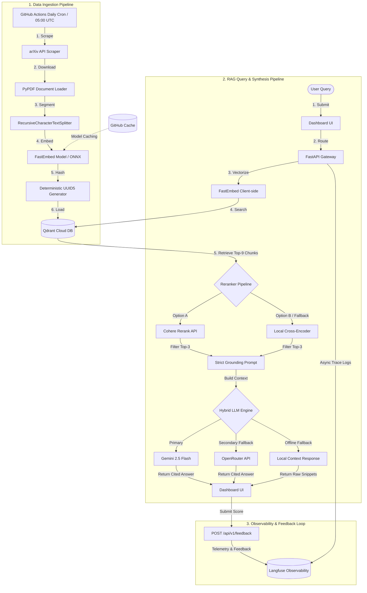

# 🌌 Antispace: Space Science RAG Assistant

**Antispace** is a high-performance, production-grade Retrieval-Augmented Generation (RAG) assistant designed for space science and astrophysics literature. It ingests academic publications (such as arXiv papers, NASA reports, and JWST documentation) and provides verified, hallucination-free answers with page-level citations.

---

## 🏗️ System Architecture & Workflow

The architecture is built around three core workflows: **Data Ingestion**, **RAG Retrieval & Generation**, and **Observability**.


```mermaid
flowchart TD
    subgraph Ingestion_Pipeline [1. Data Ingestion Pipeline]
        direction TB
        Cron[GitHub Actions Daily Cron / 05:00 UTC] -->|1. Scrape| Scrap[arXiv API Scraper]
        Scrap -->|2. Download| PDF[PyPDF Document Loader]
        PDF -->|3. Segment| Split[RecursiveCharacterTextSplitter]
        Split -->|4. Embed| FE[FastEmbed Model / ONNX]
        FE -->|5. Hash| UUID[Deterministic UUID5 Generator]
        UUID -->|6. Load| QC[(Qdrant Cloud DB)]
    end

    subgraph Query_Pipeline [2. RAG Query & Synthesis Pipeline]
        direction TB
        User([User Query]) -->|1. Submit| Web[Dashboard UI]
        Web -->|2. Route| API[FastAPI Gateway]
        API -->|3. Vectorize| FE_Q[FastEmbed Client-side]
        FE_Q -->|4. Search| QC
        QC -->|5. Retrieve Top-9 Chunks| Rerank{Reranker Pipeline}
        
        Rerank -->|Option A| Cohere[Cohere Rerank API]
        Rerank -->|Option B / Fallback| CE[Local Cross-Encoder]
        
        Cohere -->|Filter Top-3| Prompt[Strict Grounding Prompt]
        CE -->|Filter Top-3| Prompt
        
        Prompt -->|Build Context| LLM{Hybrid LLM Engine}
        LLM -->|Primary| Gemini[Gemini 2.5 Flash]
        LLM -->|Secondary Fallback| OR[OpenRouter API]
        LLM -->|Offline Fallback| Offline[Local Context Response]
        
        Gemini -->|Return Cited Answer| Res[Dashboard UI]
        OR -->|Return Cited Answer| Res
        Offline -->|Return Raw Snippets| Res
    end

    subgraph Observability_Pipeline [3. Observability & Feedback Loop]
        direction TB
        Res -->|Submit Score| Feed[POST /api/v1/feedback]
        Feed -->|Telemetry & Feedback| LF[(Langfuse Observability)]
        API -->|Async Trace Logs| LF
    end
    
    %% Caching
    Cache[(GitHub Cache)] -.->|Model Caching| FE
```

---

## 🔄 Step-by-Step Technical Execution

### Step 1: Automated Data Ingestion
1. **GitHub Actions Workflow** triggers daily at 05:00 UTC.
2. The ingestion pipeline queries the **arXiv API** for the latest publications in cosmology and planetary astrophysics (`astro-ph.CO`, `astro-ph.EP`).
3. Retreived PDFs are parsed page-by-page using `PyPDF`.
4. Text is split using `RecursiveCharacterTextSplitter` with a chunk size of `800` characters and `150` characters overlap.
5. Chunks are embedded using **FastEmbed** (`all-MiniLM-L6-v2`) in ONNX format.
6. A **Deterministic UUID5** is generated based on the chunk text, acting as an idempotency key to prevent duplicate vector entries.
7. Vectors are loaded in batches (size: 32) into **Qdrant Cloud**.

### Step 2: The API Gateway
1. A **FastAPI** server manages client requests with strict validation schemas using **Pydantic**.
2. **CORS Middleware** is configured to allow cross-origin requests, enabling separate frontend hosting options (e.g. Netlify/GitHub Pages).
3. The gateway exposes metrics, health states, RAG Q&A pipelines, and ingestion controls.

### Step 3: Semantic Retrieval & Reranking
1. User queries are vectorized in real-time.
2. An initial search retrieves the **Top-9** candidates from Qdrant based on Cosine Similarity.
3. The retrieved chunks are reranked using **Cohere Rerank** to ensure keyword and contextual alignment.
4. If the Cohere API is unavailable, the pipeline falls back to a local **Cross-Encoder** (`ms-marco-MiniLM-L-6-v2`) to re-score the candidates.
5. The **Top-3** highest-scoring chunks are selected for the LLM context.

### Step 4: Grounded LLM Generation
1. The retrieved text snippets, source files, and page numbers are formatted into a system prompt.
2. The prompt instructs the LLM to restrict responses **strictly** to the provided context and return page-level citations. If the context does not contain the answer, the LLM returns a structured "Information not found" message.
3. A multi-stage API fallback is implemented:
   - **Primary:** Gemini 2.5 Flash.
   - **Secondary Fallback:** OpenRouter free tier models (e.g. Gemma, Qwen, Llama).
   - **Tertiary Fallback (Offline Mode):** Direct return of the top matching raw snippets without LLM synthesis.

### Step 5: Telemetry & Tracing
1. **Langfuse SDK** captures latency, prompt templates, inputs, outputs, and token counts.
2. Dashboard users can submit thumbs up/down feedback, which is linked directly to the transaction trace in Langfuse for RAG quality monitoring.

---

## 📈 Engineering Highlights

*   **ONNX Optimization:** Switched from `sentence-transformers` to `fastembed` to eliminate PyTorch dependencies. This reduced the Docker image size from **2.5GB to ~600MB**, accelerating deployment times.
*   **Idempotency Protection:** Using deterministic UUID5 hashes of chunk texts ensures that running the ingestion pipeline repeatedly will overwrite matching documents rather than creating duplicate entries.
*   **Model Caching:** GitHub Actions workflows cache the FastEmbed ONNX models, reducing daily cron pipeline run times to **~40 seconds**.
*   **Observability First:** Real-time logging of latencies at each stage (retrieval, reranking, generation) facilitates continuous performance monitoring.

---

## 💻 API Reference

*   `GET /api/v1/health` - Diagnostics check (database connection status, collections, vector counts, API configuration).
*   `POST /api/v1/search` - Raw semantic query endpoint (returns matches and cosine similarity scores).
*   `POST /api/v1/ask` - End-to-end RAG endpoint (vector search, rerank, context synthesis, LLM generation with citations).
*   `POST /api/v1/feedback` - User rating logging.
*   `POST /api/v1/ingest/daily` - Ingestion trigger to fetch new publications from arXiv.

---

## ⚙️ Quick Start

### 1. Environment Variables
Create a `.env` file at the root of the project:
```env
QDRANT_URL=https://your-qdrant-cluster.io
QDRANT_API_KEY=your_qdrant_api_key
GEMINI_API_KEY=your_gemini_api_key
COHERE_API_KEY=your_cohere_key (optional)
LANGFUSE_PUBLIC_KEY=your_public_key (optional)
LANGFUSE_SECRET_KEY=your_secret_key (optional)
```

### 2. Run with Docker Compose
```bash
docker compose up --build
```
Access the application dashboard at `http://localhost:8000`.

### 3. Manual Ingestion
To manually run the ingestion scripts:
```bash
# Upload local JWST and Kepler PDFs
python embedding-test/ingest_to_qdrant.py

# Fetch and ingest latest arXiv papers
python embedding-test/ingest_daily_arxiv.py
```
